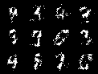
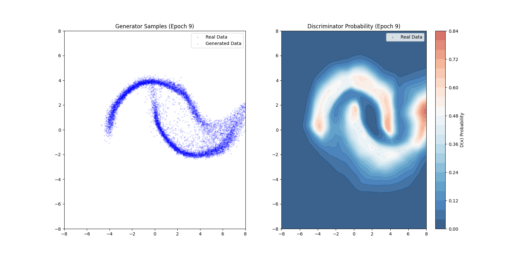

# \[Name\]

   An implementation of variants of GANs. 

   | Figure 1 | Figure 2 |
   |----------|----------|
   |  |  | 
   | |  | 


   Setup conda env. 
   ```
   conda create -n env python=3.13 -y
   conda create -p ~/xt/condaenvs/env python=3.13 -y
   ```
   Install relevant packages. 
   ```
   pip install torch torchvision scikit-learn numpy matplotlib pyyaml tqdm ipython debugpy wandb scipy gdown kagglehub
   ```

   Run example script to train MLP on MNIST. 
   ```
   python main.py --cfg=setup/cfg/example_mlp.yml
   ```

## Implementation Details 

### Model Flexibility 

   In the MLP, even adding one more fully connected layer caused mode collapse, and playing around with the hyperparameters and increasing the discriminator/generator training epoch ratio to 50:1 didn't do anything. 


