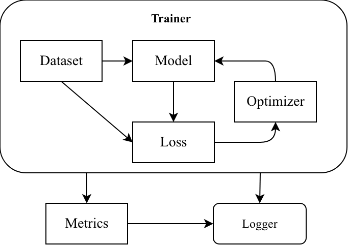
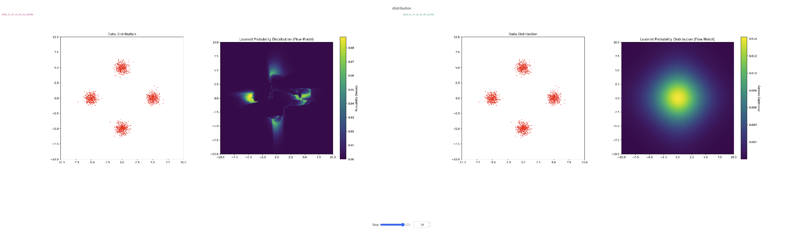

# Normalizing Flows

   \[Abstract\]

   Some teaser figures here. 

   


   Setup conda env. 
   ```
   conda create -n env python=3.13 -y
   conda create -p ~/xt/condaenvs/env python=3.13 -y
   ```
   Install relevant packages. 
   ```
   pip install torch torchvision scikit-learn numpy matplotlib pyyaml tqdm ipython debugpy wandb scipy gdown kagglehub
   ```

   Run example script to train MLP on MNIST. 
   ```
   python main.py --cfg=setup/cfg/example_mlp.yml
   ```

# Findings 

### NICE needs to be sufficiently deep enough even to learn simple probability distributions 

   When running `nice_shallow_bad_4gauss.yml`, we are working with a pretty shallow model and the model could not converge. Increasing the depth of both the coupling layers and the MLP leads to better results after 50 epochs. There was a time when I had a dataset size of 10000, it had bad convergence. Decreasing it to 1000 seemed to make it escape the "unimodal" distribution earlier. However, this doesn't seem to be a problem. 

   


   
